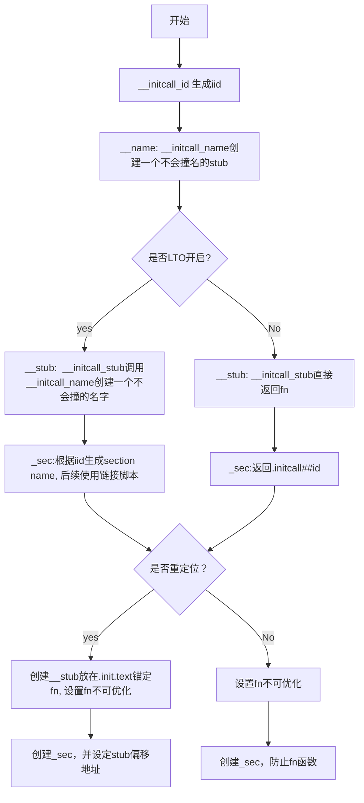
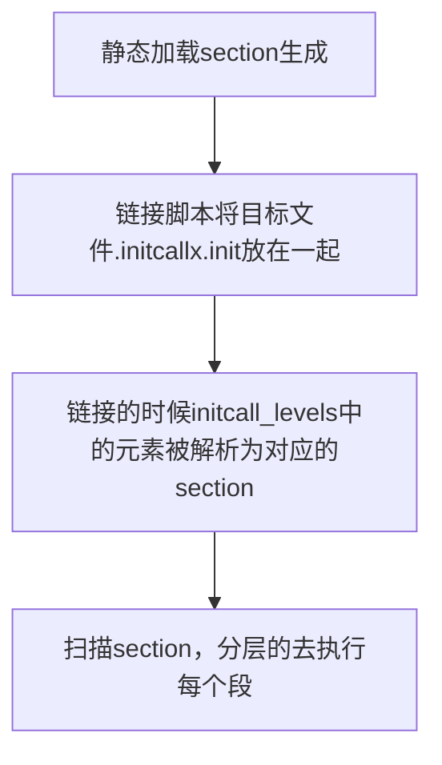
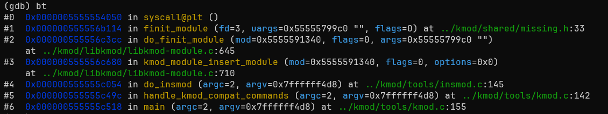

这里仍然是一个比较简单的项目，我这里将主要的叙述内容放在其中一些gcc扩展语法上。
这两个attribute都非必须的，但是可以提高可读性。他们分别表示
1. `__init`表示这个函数属于用来初始化的函数
2. `__exit`表示这个函数属于模块被卸载的时候执行的函数

# 模块加载
首先我们看到`module_init`，这里我们点击跳转后会跳转到`module.h`文件下面的代码：

```c
/* Each module must use one module_init(). */
#define module_init(initfn)					\
	static inline initcall_t __maybe_unused __inittest(void)		\
	{ return initfn; }					\
	int init_module(void) __copy(initfn)			\
		__attribute__((alias(#initfn)));		\
	___ADDRESSABLE(init_module, __initdata);
```

但是实际的`module_init`是有两个定义的，因为我在`c_cpp_properties.json`中声明了`defines`包含`MODULE`，这恰好是一个条件编译的变量。
> 正常来说我们这里是动态加载的，所以预先defines MODULE是应该的，这样才不会出现代码红线错误

原本还有：

```c
#ifndef MODULE
/**
 * module_init() - driver initialization entry point
 * @x: function to be run at kernel boot time or module insertion
 *
 * module_init() will either be called during do_initcalls() (if
 * builtin) or at module insertion time (if a module).  There can only
 * be one per module.
 */
#define module_init(x)	__initcall(x);

/**
 * module_exit() - driver exit entry point
 * @x: function to be run when driver is removed
 *
 * module_exit() will wrap the driver clean-up code
 * with cleanup_module() when used with rmmod when
 * the driver is a module.  If the driver is statically
 * compiled into the kernel, module_exit() has no effect.
 * There can only be one per module.
 */
#define module_exit(x)	__exitcall(x);

#else /* MODULE */
```

这其实就是模块动态加载和静态编译两种方式。

---

如果学过`xv6`，就会知道os起来的时候会执行一堆的`xxx_init`。你要添加一个新的模块，如果都要涉及到修改linux启动的源码的话，是一个很灾难的事情——你修改简单的东西就得重新编译内核。

Linux提供一种机制，去扫描模块初始化函数。这里先不细讲，后续再展开。

---

## 静态加载

这里首先从静态加载开始，也就是：

```c
#define module_init(x)	__initcall(x);
```

跟进`__initcall`可以得到：

```c
/*
 * Early initcalls run before initializing SMP.
 *
 * Only for built-in code, not modules.
 */
#define early_initcall(fn)		__define_initcall(fn, early)

/*
 * A "pure" initcall has no dependencies on anything else, and purely
 * initializes variables that couldn't be statically initialized.
 *
 * This only exists for built-in code, not for modules.
 * Keep main.c:initcall_level_names[] in sync.
 */
#define pure_initcall(fn)		__define_initcall(fn, 0)

#define core_initcall(fn)		__define_initcall(fn, 1)
#define core_initcall_sync(fn)		__define_initcall(fn, 1s)
#define postcore_initcall(fn)		__define_initcall(fn, 2)
#define postcore_initcall_sync(fn)	__define_initcall(fn, 2s)
#define arch_initcall(fn)		__define_initcall(fn, 3)
#define arch_initcall_sync(fn)		__define_initcall(fn, 3s)
#define subsys_initcall(fn)		__define_initcall(fn, 4)
#define subsys_initcall_sync(fn)	__define_initcall(fn, 4s)
#define fs_initcall(fn)			__define_initcall(fn, 5)
#define fs_initcall_sync(fn)		__define_initcall(fn, 5s)
#define rootfs_initcall(fn)		__define_initcall(fn, rootfs)
#define device_initcall(fn)		__define_initcall(fn, 6)
#define device_initcall_sync(fn)	__define_initcall(fn, 6s)
#define late_initcall(fn)		__define_initcall(fn, 7)
#define late_initcall_sync(fn)		__define_initcall(fn, 7s)

#define __initcall(fn) device_initcall(fn)
```

可以看到`__initcall`等于`device_install`同时也等效于`__define_install`。

```c
#define __unique_initcall(fn, id, __sec, __iid)			\
	____define_initcall(fn,					\
		__initcall_stub(fn, __iid, id),			\
		__initcall_name(initcall, __iid, id),		\
		__initcall_section(__sec, __iid))

#define ___define_initcall(fn, id, __sec)			\
	__unique_initcall(fn, id, __sec, __initcall_id(fn))

#define __define_initcall(fn, id) ___define_initcall(fn, id, .initcall##id)
```

可以看到`__define_initcall`里面多出来的这个`id`参数会使得代码放在某一段中，比如`.initcall3`。所以现在来看其实你可以将上面定义的很多`xxx_initcall`函数看作周期函数，比如`postcore_install`表示core finished之后做的处理。因此`id`就可以理解为优先级的作用。


### 深入__define_initcall

你可以选择跳过，如果不感兴趣，确实有点绕 :D

#### __initcall_id

首先我们层层递进，现在进入`__unique_initcall`，可以看到它的第四个参数是调用的`__initcall_id`来扩充的。我们跳转到这个函数：
```c
/*
 * initcalls are now grouped by functionality into separate
 * subsections. Ordering inside the subsections is determined
 * by link order. 
 * For backwards compatibility, initcall() puts the call in 
 * the device init subsection.
 *
 * The `id' arg to __define_initcall() is needed so that multiple initcalls
 * can point at the same handler without causing duplicate-symbol build errors.
 *
 * Initcalls are run by placing pointers in initcall sections that the
 * kernel iterates at runtime. The linker can do dead code / data elimination
 * and remove that completely, so the initcall sections have to be marked
 * as KEEP() in the linker script.
 */

/* Format: <modname>__<counter>_<line>_<fn> */
#define __initcall_id(fn)					\
	__PASTE(__KBUILD_MODNAME,				\
	__PASTE(__,						\
	__PASTE(__COUNTER__,					\
	__PASTE(_,						\
	__PASTE(__LINE__,					\
	__PASTE(_, fn))))))
```

**可以看到`__initcall_id`的作用就类似于生成一个uid，作为唯一标识，避免重复build。**

在这个宏里面使用了很多`__PASTE`，这个宏展开是`#define __PASTE(a, b) a##b`，他表示将a和b进行拼接。最终形成的一个格式是`<modname>__<counter>_<line>_<fn>`

> `__COUNTER__`表示一个计数器，每次编译使用到这个位置则+1。

---

#### __initcall_section
`____define_initcall`里面使用了三个宏

```c
#define __unique_initcall(fn, id, __sec, __iid)			\
	____define_initcall(fn,					\
		__initcall_stub(fn, __iid, id),			\
		__initcall_name(initcall, __iid, id),		\
		__initcall_section(__sec, __iid))
```

而其中的`__initcall_section`和`__initcall_stub`也有条件编译：

```c
#ifdef CONFIG_LTO_CLANG
/*
 * With LTO, the compiler doesn't necessarily obey link order for
 * initcalls. In order to preserve the correct order, we add each
 * variable into its own section and generate a linker script (in
 * scripts/link-vmlinux.sh) to specify the order of the sections.
 */
#define __initcall_section(__sec, __iid)			\
	#__sec ".init.." #__iid

/*
 * With LTO, the compiler can rename static functions to avoid
 * global naming collisions. We use a global stub function for
 * initcalls to create a stable symbol name whose address can be
 * taken in inline assembly when PREL32 relocations are used.
 */
#define __initcall_stub(fn, __iid, id)				\
	__initcall_name(initstub, __iid, id)

#define __define_initcall_stub(__stub, fn)			\
	int __init __stub(void);				\
	int __init __stub(void)					\
	{ 							\
		return fn();					\
	}							\
	__ADDRESSABLE(__stub)
#else
#define __initcall_section(__sec, __iid)			\
	#__sec ".init"

#define __initcall_stub(fn, __iid, id)	fn

#define __define_initcall_stub(__stub, fn)			\
	__ADDRESSABLE(fn)
#endif
```

根据注释可以看到，关于`__install_section`，大致的意思就是说，**在开启clang的LOT优化后编译器就不再遵循链接顺序了，所以为保证整个链接顺序，代码会在段的后面加上标识符，同时生成一个`scripts/link-vmlinux.sh`脚本，这个脚本用来标明section的顺序。**

而如果没有开启那就先来后到的顺序。

#### __initcall_name

```c
/* Format: __<prefix>__<iid><id> */
#define __initcall_name(prefix, __iid, id)			\
	__PASTE(__,						\
	__PASTE(prefix,						\
	__PASTE(__,						\
	__PASTE(__iid, id))))
```

用于根据之前提到的uid和我们设置的优先级**生成一串文本，格式为`__<prefix>__<iid><id>`。**

#### __initcall_stub
在代码中使用`stub`的情况是进行重定位的时候，因为`stub`的作用在于是一个锚点，每次记录一下偏移值，下次直接通过偏移值找到`stub`，而`stub`又指向原本的函数，就可能进行成功调用。

但是`__initcall_stub`是存在两个版本的，分为是否开启LTO。

如果开启了LTO，编译会对static function进行重命名，去避免命名冲突。这个`stub`是在`LTO`开启的情况下也是一个`global`符号，所以也得确保它的不重复性。**所以在LTO开启的时候需要使用`__install_name`来为stub提供一个不会重复的名称。**

**不开启LTO的话，文件的编译都是分开的，这里的stub其实可以当作不存在，你也可以看到及本身stub有的函数都是返回`fn`**。

> 那为什么是static function呢，因为c语言中static声明的function作用域被局限于自己的文件，所以这样可以做到一个防止function泄露或被其他文件调用的风险。自在一片小世界，按理来说在进行编译链接的时候，static的符号也不会出现在全局符号表，不应该产生冲突啊。
>
> 而开启LTO，意味着可以进行跨文件优化，因为以前的优化可能就单个文件优化，也就说一些`extern`的变量是不能动的，因为只看到了这一个文件。但是LTO开启后，它跨文件分析，可以看到extern的变量没被使用就会被优化掉。那其实这样就意味着static对于LTO来说可能没有隔离的效果了，那函数名就得保证不重复。

#### __define_initcall_stub

```c
#define __define_initcall_stub(__stub, fn)			\
	int __init __stub(void);				\
	int __init __stub(void)					\
	{ 							\
		return fn();					\
	}							\
	__ADDRESSABLE(__stub)
```

首先这个宏是这样的：

1. 给出`__stub`的定义
2. 给出`__stub`的内容——返回fn函数
3. 锚定`__stub`

这里来说一下第三点`__ADDRESSABLE(__stub)`:

```c
#define ___ADDRESSABLE(sym, __attrs)						\
	static void * __used __attrs						\
	__UNIQUE_ID(__PASTE(__addressable_,sym)) = (void *)(uintptr_t)&sym;

#define __ADDRESSABLE(sym) \
	___ADDRESSABLE(sym, __section(".discard.addressable"))
```

这里顺序是这样的：

1. `static void *`定义静态空指针
2. `__used __attrs`：不要优化，因为是used，并把它存放在`.discard.addressable`段
3. `__UNIQUE_ID(__PASTE(__addressable_,sym))`：定义一个唯一的变量名
4. `(void *)(uintptr_t)&sym`：当前的函数的地址传递给变量

等于说这里我定义了一个变量，它锚定了你，你不会被释放了。

但是并不会说，因为一直有一个引用锚定你，所以你没法释放。因为`.discard.addressable`在链接的时候会被丢弃，所以后续其实就不会出现内存泄露的问题。

---
总结来说，从我的理解来看：
LTO会因为跨文件优化导致原本static的函数出现命名冲突，如果不是重定位都还好，因为我们可以看到:
```c
#define ____define_initcall(fn, __unused, __name, __sec)	\
	static initcall_t __name __used 			\
		__attribute__((__section__(__sec))) = fn;
```
有明显的ref关系，LTO会自行解决。

但是如果是重定位的话，并没有明显的引用关系，所以LTO可能不会更改fn，就会导致重定位失效。但是stub的设定是`return fn()`是于是调用的`fn`，这里会进行修改名称，所以可以通过stub找到fn的值。但是stub既然一个全局符号，在LTO的情况下肯定得保持唯一性。


#### ____define_initcall

```c
#ifdef CONFIG_HAVE_ARCH_PREL32_RELOCATIONS
#define ____define_initcall(fn, __stub, __name, __sec)		\
	__define_initcall_stub(__stub, fn)			\
	asm(".section	\"" __sec "\", \"a\"		\n"	\
	    __stringify(__name) ":			\n"	\
	    ".long	" __stringify(__stub) " - .	\n"	\
	    ".previous					\n");	\
	static_assert(__same_type(initcall_t, &fn));
#else
#define ____define_initcall(fn, __unused, __name, __sec)	\
	static initcall_t __name __used 			\
		__attribute__((__section__(__sec))) = fn;
#endif
```

这里定义了两个，还是一个重定位的问题。

如果是重定位则：

1. 设置section为`_sec`
2. 设置`a`，表示可分配
3. `__stringify(__name)`给表项起名，用于定位
4. `.long   __stub - .`相对偏移地址，指向`_stub`，后续这个值被取出来寻址再去执行stub
5. `.previous`：回到之前的段

---

第二个`____define_initcall`的作用是：

1. `static initcall_t __name`：变量名和类型
2. `__used`：属性
3. `__attribute__((__section__(__sec)))`：section属性
4. `fn`：指向fn

相当于之前设定的全局符号`name`指向了真正的函数。毕竟不需要重定位嘛。这里命令为`_name`应该是规范问题。

#### 总结



这里的几个变量情况：

fn：fn，函数名

id：优先级，比如设置为6

_iid：格式`<modname>__<counter>_<line>_<fn>`

_sec：开始`.initcall6`，然后根据`__initcall_section`变成`.initcall6.init`（LTO关闭）或者`.initcall6.init..<modname>__<counter>_<line>_<fn>`（LTO开启）

__name：`__initcall__<iid><id>`


### 模块注册流程

```
start_kernel  
	-> rest_init();
		-> kernel_thread(kernel_init, NULL, CLONE_FS);
			-> kernel_init()
				-> kernel_init_freeable();
					-> do_basic_setup();
						-> do_initcalls();
							-> do_initcall_level();
								-> do_one_initcall();
```

可以通过[Kernel source code](https://elixir.bootlin.com/linux/v6.12.34/source/kernel/params.c#L161)进行查看。

```c
static initcall_entry_t *initcall_levels[] __initdata = {
	__initcall0_start,
	__initcall1_start,
	__initcall2_start,
	__initcall3_start,
	__initcall4_start,
	__initcall5_start,
	__initcall6_start,
	__initcall7_start,
	__initcall_end,
};

/* Keep these in sync with initcalls in include/linux/init.h */
static const char *initcall_level_names[] __initdata = {
	"pure",
	"core",
	"postcore",
	"arch",
	"subsys",
	"fs",
	"device",
	"late",
};

static int __init ignore_unknown_bootoption(char *param, char *val,
			       const char *unused, void *arg)
{
	return 0;
}

static void __init do_initcall_level(int level, char *command_line)
{
	initcall_entry_t *fn;

	parse_args(initcall_level_names[level],
		   command_line, __start___param,
		   __stop___param - __start___param,
		   level, level,
		   NULL, ignore_unknown_bootoption);

	trace_initcall_level(initcall_level_names[level]);
	for (fn = initcall_levels[level]; fn < initcall_levels[level+1]; fn++)
		do_one_initcall(initcall_from_entry(fn));
}

static void __init do_initcalls(void)
{
	int level;
	size_t len = saved_command_line_len + 1;
	char *command_line;

	command_line = kzalloc(len, GFP_KERNEL);
	if (!command_line)
		panic("%s: Failed to allocate %zu bytes\n", __func__, len);

	for (level = 0; level < ARRAY_SIZE(initcall_levels) - 1; level++) {
		/* Parser modifies command_line, restore it each time */
		strcpy(command_line, saved_command_line);
		do_initcall_level(level, command_line);
	}

	kfree(command_line);
}
```

可以看到这里的`initcall_level_names` 刚好就和我们之前所说的哪些个周期函数对应上（`early_install`不涉及到module install）

顺着链路看，首先`do_initinstalls`中遍历了所有的`level`，并调用`do_initcall_level`去调用每个level，也就是对应的一个section中的每个函数：

```c
for (fn = initcall_levels[level]; fn < initcall_levels[level+1]; fn++)
		do_one_initcall(initcall_from_entry(fn));
```

那么问题来了，每个`__initcallx_start`是从哪来的值。

---

```c
// include/asm-generic/vmlinux.lds.h
#define INIT_CALLS_LEVEL(level)						\
		__initcall##level##_start = .;				\
		KEEP(*(.initcall##level##.init))			\
		KEEP(*(.initcall##level##s.init))			\

#define INIT_CALLS							\
		__initcall_start = .;					\
		KEEP(*(.initcallearly.init))				\
		INIT_CALLS_LEVEL(0)					\
		INIT_CALLS_LEVEL(1)					\
		INIT_CALLS_LEVEL(2)					\
		INIT_CALLS_LEVEL(3)					\
		INIT_CALLS_LEVEL(4)					\
		INIT_CALLS_LEVEL(5)					\
		INIT_CALLS_LEVEL(rootfs)				\
		INIT_CALLS_LEVEL(6)					\
		INIT_CALLS_LEVEL(7)					\
		__initcall_end = .;
```

上面的linux链接脚本就是来源。`INIT_CALLS`里面对所有level进行了init。

其中`__initcall##level##_start = .;`表示标记当前位置的地址。而`KEEP`的作用是为了保证所有的符号都在section中，即使是没有被ref。

然后在`INIT_CALLS`中一次处理所有level，因为`early_install`比所有的install都要早，所以在最前面。结合前面的编译流程，在编译的时候生成`.o`文件会包含比如说`.initcall6.init`这个section在elf文件，而在链接的时候，我们将所有的目标文件里面的`.initcall6.init`都链接到`INIT_CALLS_LEVEL`标明的位置。

---
最后化繁为简的话，整个流程如下



## 动态加载

此时你兴冲冲的去编译你的代码，然后`readelf -S xxx.ko`，你会发现怎么没有`.initcallx.init`文件：

```bash
 1: 0000000000000000     0 SECTION LOCAL  DEFAULT    1 .text
 2: 0000000000000000     0 SECTION LOCAL  DEFAULT    2 .init.text
 3: 0000000000000000     0 SECTION LOCAL  DEFAULT    4 .exit.text
 4: 0000000000000000     0 SECTION LOCAL  DEFAULT    6 __patchable_func[...]
 5: 0000000000000000     0 SECTION LOCAL  DEFAULT    8 .data
 6: 0000000000000000     0 SECTION LOCAL  DEFAULT    9 .exit.data
 7: 0000000000000000     0 SECTION LOCAL  DEFAULT   11 .init.data
 8: 0000000000000000     0 SECTION LOCAL  DEFAULT   13 .gnu.linkonce.th[...]
 9: 0000000000000000     0 SECTION LOCAL  DEFAULT   15 .plt
10: 0000000000000000     0 SECTION LOCAL  DEFAULT   16 .init.plt
11: 0000000000000000     0 SECTION LOCAL  DEFAULT   17 .text.ftrace_tra[...]
12: 0000000000000000     0 SECTION LOCAL  DEFAULT   18 .rodata.str1.8
13: 0000000000000000     0 SECTION LOCAL  DEFAULT   19 .modinfo
14: 0000000000000000     0 SECTION LOCAL  DEFAULT   20 .note.gnu.property
15: 0000000000000000     0 SECTION LOCAL  DEFAULT   21 .note.gnu.build-id
16: 0000000000000000     0 SECTION LOCAL  DEFAULT   22 .note.Linux
17: 0000000000000000     0 SECTION LOCAL  DEFAULT   23 __versions
18: 0000000000000000     0 SECTION LOCAL  DEFAULT   24 .bss
19: 0000000000000000     0 SECTION LOCAL  DEFAULT   25 .note.GNU-stack
20: 0000000000000000     0 SECTION LOCAL  DEFAULT   26 .comment
```

---

我们前面说过module有动态加载和静态加载两种，现在我们来看看动态加载是如何运作的：
```c
#define module_init(initfn)					\
	static inline initcall_t __maybe_unused __inittest(void)		\
	{ return initfn; }					\
	int init_module(void) __copy(initfn)			\
		__attribute__((alias(#initfn)));		\
	___ADDRESSABLE(init_module, __initdata);
```

这里`__inittest`的作用是为了检查`initfn`的signature是否符合`initcall_t`，即`typedef int (*initcall_t)(void);`，需要即没有参数传递同时返回值是int。

然后下面是定义了一个`init_module`函数，这个函数copy了`initfn`的属性值，同时他属于`initfn`的一个别名。

`___ADDRESSABLE(init_module, __initdata);`则是创建了一个变量引用`init_module`，这个变量被放置在`.init.data`这个数据段。

---

`make all`之后我们会生成文件`hello.mod.c`

```c
#include <linux/module.h>
#include <linux/export-internal.h>
#include <linux/compiler.h>

MODULE_INFO(name, KBUILD_MODNAME);

__visible struct module __this_module
__section(".gnu.linkonce.this_module") = {
	.name = KBUILD_MODNAME,
	.init = init_module,
#ifdef CONFIG_MODULE_UNLOAD
	.exit = cleanup_module,
#endif
	.arch = MODULE_ARCH_INIT,
};


static const struct modversion_info ____versions[]
__used __section("__versions") = {
	{ 0x122c3a7e, "_printk" },
	{ 0x39ff040a, "module_layout" },
};

MODULE_INFO(depends, "");


MODULE_INFO(srcversion, "703907F2675B0C5B3A76CAB");

```

定义了一个`__this.module`他具有属性`init_module`。

---

之后的流程属于[`insmod`](https://github.com/kmod-project/kmod/blob/master/tools/insmod.c)，属于kmod（`insmod -V`可以看到来源于`kmod`）的功能。

```c
static int do_insmod(int argc, char *argv[])
{
	...
    // 创建上下文和内核进行交互
	ctx = kmod_new(NULL, &null_config);
	if (!ctx) {
		ERR("kmod_new() failed!\n");
		r = EXIT_FAILURE;
		goto end;
	}

	log_setup_kmod_log(ctx, verbose);
	// 根据文件信息初始化模块的一些基本信息，也会根据name和hash查看mod_pool是否存在这个模块
    // 如果有就返回，没有就创建新的metadata。
	r = kmod_module_new_from_path(ctx, filename, &mod);
	if (r < 0) {
		ERR("could not load module %s: %s\n", filename, strerror(-r));
		goto end;
	}
	// 插入模块
	r = kmod_module_insert_module(mod, flags, opts);
	if (r < 0)
		ERR("could not insert module %s: %s\n", filename, mod_strerror(-r));

	kmod_module_unref(mod);

end:
	kmod_unref(ctx);
	free(opts);

	log_close();
	return r == 0 ? EXIT_SUCCESS : EXIT_FAILURE;
}

```

插入模块部分是真正做实事的。但是在我们查看源码的时候会发现kmod的源码自带的`syscall`和`finit_module`。但是当我们使用`strace`去获得系统调用的时候会发现`finit_module`是一个系统调用。

因此现在我们下载`kmod`的源码，编译`insmod`，进行gdb调试，因为本身系统自带的`insmod`是不存在调试信息的。

```bash
# now in 02_better_hello
sudo gcc --args /insmod_install_dir/insmod hello.ko
# gcc command
b finit_module
```

可以看见我们确实是进入了自带的`finit_module`：

```c
#ifndef HAVE_FINIT_MODULE
#include <errno.h>

static inline int finit_module(int fd, const char *uargs, int flags)
{
	if (__NR_finit_module == -1) {
		errno = ENOSYS;
		return -1;
	}

	return syscall(__NR_finit_module, fd, uargs, flags);
}
#endif
```

但是当执行到`syscall`的时候是跳转到系统调用去的。



---

所以现在会带kernel的源码

```c
// kernel/module/main.c
SYSCALL_DEFINE3(finit_module, int, fd, const char __user *, uargs, int, flags)
{
	int err;
	struct fd f;

	err = may_init_module();
	if (err)
		return err;

	pr_debug("finit_module: fd=%d, uargs=%p, flags=%i\n", fd, uargs, flags);

	if (flags & ~(MODULE_INIT_IGNORE_MODVERSIONS
		      |MODULE_INIT_IGNORE_VERMAGIC
		      |MODULE_INIT_COMPRESSED_FILE))
		return -EINVAL;

	f = fdget(fd);
	err = idempotent_init_module(fd_file(f), uargs, flags);
	fdput(f);
	return err;
}
```

顺着调用链

```
SYSCALL_finit_module
	-> idempotent_init_module
		->  init_module_from_file
			-> load_module
				-> do_init_module
					-> do_one_initcall # 因为mod.init的部分是不为空的
						-> fn() # 执行函数
```


## 总结

整个过程是很复杂的，但是抽丝剥茧后还是比较明了的。整体我的感受是：

当我们去动态加载模块的时候需要做的事情顺序如下：

1. 在内核的环境下去make编译文件，这样会保证你的符号符合内核的环境，同时ko文件的格式也算对内核的适配
2. `insmod`程序在用户态的情况下先对`ko`文件进行预先处理
3. 但是因为本身是属于一个内核模块，所以需要在内核的情况下去进行初始化，这样才能保证你的功能。所以会通过syscall进入内核环境进行系统调用。
4. 在内核环境中这个时候需要去读取加载你的`ko(elf)`文件，然后执行里面的`init`的代码，和其他的一些操作，maybe可能还有内核模块上锁，注册模块之类的，这个我就没细看了。
5. 执行完后返回用户空间进行余下处理。


## ref

1. [LTO相关博客](https://convolv.es/guides/lto/)
2. [LTO官方说明](https://llvm.org/docs/LinkTimeOptimization.html)
3. [Linux 内核：initcall机制与module_init](https://www.cnblogs.com/schips/p/linux_kernel_initcall_and_module_init.html)
4. [GCC Attribute说明](https://gcc.gnu.org/onlinedocs/gcc/Common-Function-Attributes.html)
5. [KMOD仓库](https://github.com/kmod-project/kmod)


